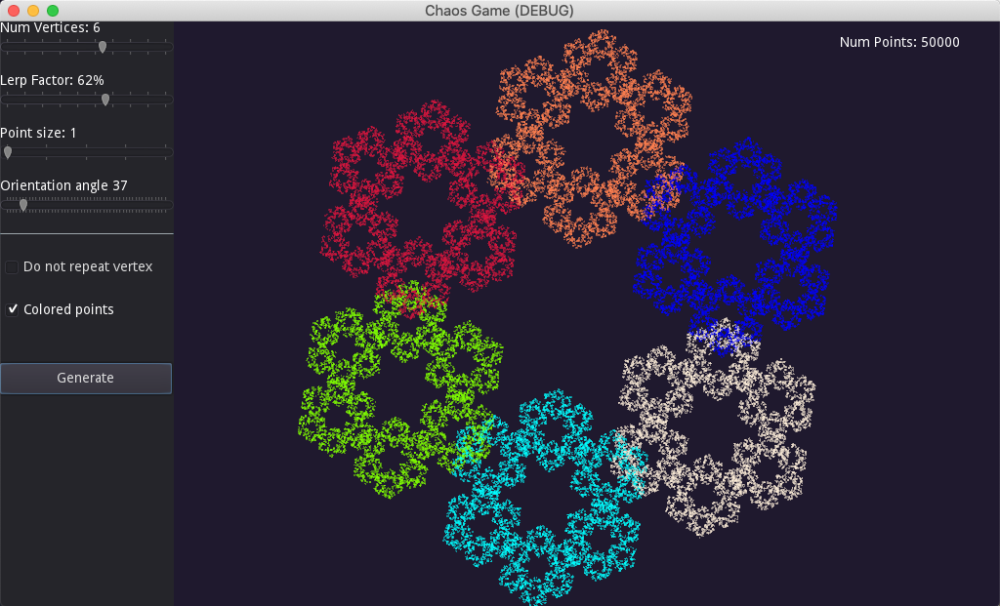
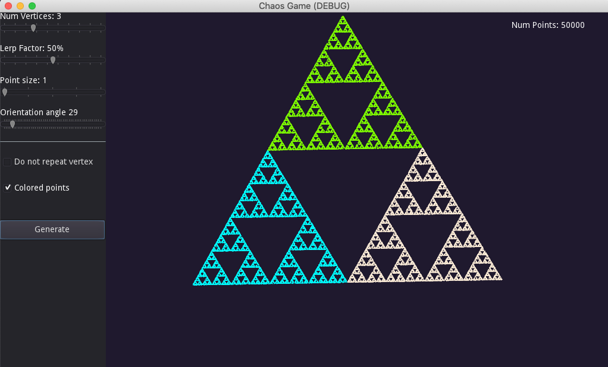
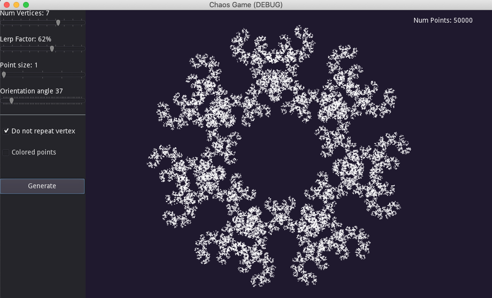
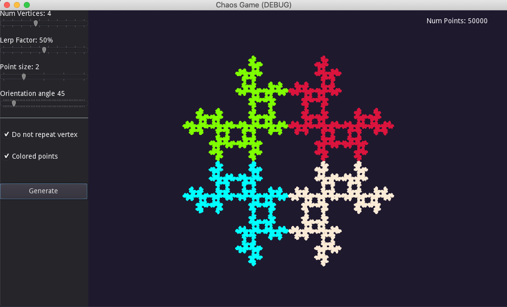

# About
[Chaos Game](https://en.wikipedia.org/wiki/Chaos_game) is a simple fractal generation technique which can yield some really interesting shapes by tweaking some basic parameters.

While Chaos Game has lots of interesting variations I've stuck to the basic ones which include varying the number of polygon vertices, the lerp factor (which determines how the points for fractal generation are chosen), and whether the randomly chosen vertex in an interation can be the same as previous iteration. 

Even with these simple parameters it's possible to generate many interesting shapes. The wikipedia page has more information on the subject.

Here are some examples of shapes generated using this program:

